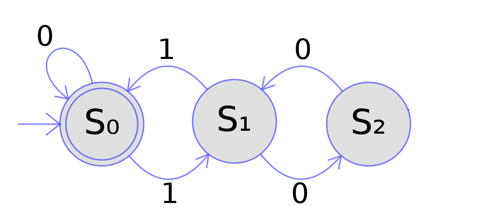

## Simulador de Autômato Finito

### Lucas Elias de Andrade Cruvinel
#### Github: https://github.com/Lucrilhas/Trabalho01LFA
#### Youtube: Não consegui subir o vídeo no youtube por estar sem wifi, apenas no 4g.

#### Introdução
Nesse trabalho foi realizado o trabalho de implementar um simulador de autômato 
finito que funcione tanto para autômatos deterministo (DFA) quanto não deterministico (NFA).

Conforme a proposto do próprio professor, foi implementado inicialmente o DFA e 
posteriormente um conversor de NFA para DFA

#### Requisitos
O código foi implementado utilizando a linguagem de programação Python, em especifico utilizando
a versão 3.10, embora não se tenha feito testes é esperado que funcione para qualquer versão
acima do 3.7. 

Além disso o ambiente de implementação foi em uma máquina com o sistema operacional
Windows 11, porém novamente mesmo sem ter feitos testes é esperado funcionar em qualquer máquina
que o Python tenha suprte.

#### Entradas
Para iniciar, é necessário preencher o arquivo 'entrada.txt' com os dados do autônomo,
sendo esses dados:

* Regras de Transição
* Estado inicial
* Estados finais
* Palavras

Exemplo do seguinte automato da imagem como entrada:

```
{
    "regras_de_transicao":[
    s0, s0, 0
    s0, s1, 1
    s1, s0, 1
    s1, s2, 0
    s2, s1, 0
    ]
    "estado_inicial": s0
    "estado_final":[
    s0
    ]
    "palavras":[
    0
    1,0
    1,0,1
    0,0,1
    1,0,2
    1,0,0,1
    1,0,1,0,1
    ]
}
```
O arquivo de entrada já contém vários exemplos de entrada caso houver maiores dúvidas.

#### Execução

Para execução é necessário executar o arquivo '_ _ init_ _.py' utilizando o Python, sendo
a partir de comando via console ou utilizando uma IDE.

O arquivo '_ _ init_ _.py' serve apenas como uma função incial para chamar as outras funções.

Após a execução o código irá ler e interpretar os dados de entrada, interpretando-o e 
criando o resto dos dados como Alfabeto, Estados e Tipo.

Toda a parte de leitura e execução do arquivo de entrada se encontra no arquivo 'textos.py' e
os dados ficam salvos como instancia da classe Autonomo que se encontra no arquivo 'automato.py'.

A apartir do tipo analisado, o código agirá de acordo, caso seja DFA irá apenas realizar a execução,
caso seja NFA irá acontecer a conversão de NFA para DFA e então executar como DFA.

#### DFA

A execução do DFA se encontra no arquivo 'automato.py' na classe DFA que recebe como entrada uma
instancia da classe Automato.

A partir disso irá realizar uma iteração para cada "letra" da palavra de entrada e a partir dessa
letra será realizado uma mudança de estado de acordo, começando pelo estado inicial informado.

Ao final da palavra será análisada o estado de parada e verificado se é um dos estados finais informados.

Esse processo será realizado para cada palavra de entrada informada pelo usuário.

#### NFA

A conversão de NFA para DFA começa já na interpretação da entrada do usuário, onde é
verificado se um estado tem mais de um estado de aceitação, modificando o atributo 'tipo'
da instancia autonomo.

Com isso o objetivo da função 'nfa_to_dfa' que se encontra no arquivo 'automato.py' é dividir esse estado
com mais estados de aceitação em diferentes estados. Para isso, é feito uma análise de quais são os 
próximos estados desse estado não deterministico.

E então esse estado não deterministico será criado novas regras de transição para apontar para esse novo
estado criado. Dessa forma reformulando todas as regras de transição envolvidas com esses estados.

Dessa forma será criado um novo automato a partir desse, porém esse novo sendo um automato deterministico
e iniciando o processo de DFA como descrito acima.

#### Resultado

Todos os resultados são salvos em um arquivo de texto 'saida.txt', que tem uma estrutura similar
a um JSON, para todos os automatos informados de entrada.

Exemplo encontrado no arquivo 'saida.txt' do exemplo apresentado acima:
```
{
	Estados: ['s0', 's1', 's2']
	Estado inicial: ['s0']
	Estado final: ['s0']
	Alfabeto: ['0', '1']
	Regras de transição:[
				0					1					
		s0		['s0']				['s1']				
		s1		['s2']				['s0']				
		s2		['s1']				[]				
	]
	Palavras:[
		['0']	->	O automato consegue ler essa palavra
		['0', '0', '1']	->	A palavra não termina em um estado final, logo não é aceitavel
		['1', '0']	->	A palavra não termina em um estado final, logo não é aceitavel
		['1', '0', '0', '1']	->	O automato consegue ler essa palavra
		['1', '0', '1']	->	O automato NÃO consegue ler essa palavra
		['1', '0', '1', '0', '1']	->	O automato NÃO consegue ler essa palavra
		['1', '0', '2']	->	Essa palavra contém valores fora do alfabeto do automato
	]
	Tipo: dfa
}
```