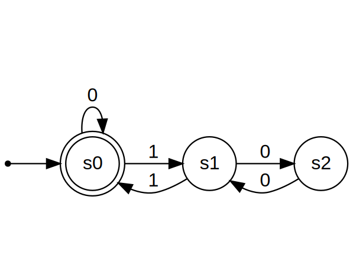
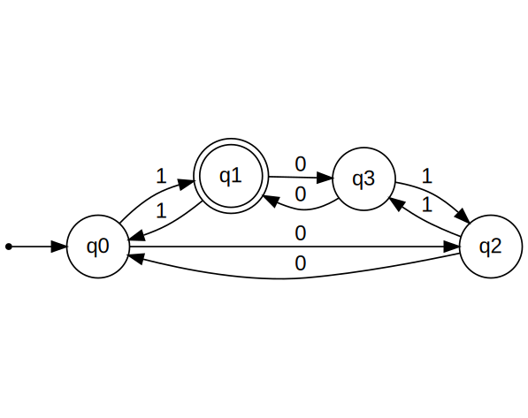
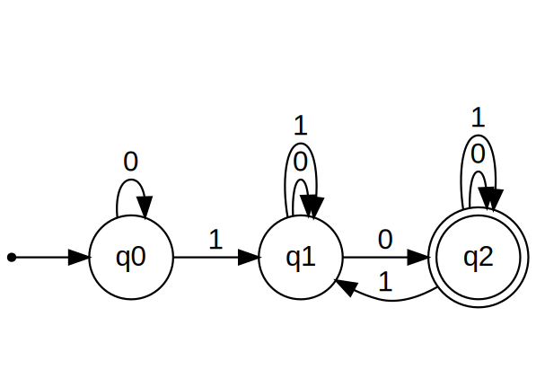
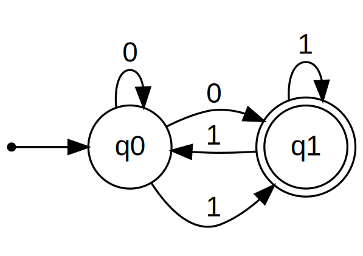
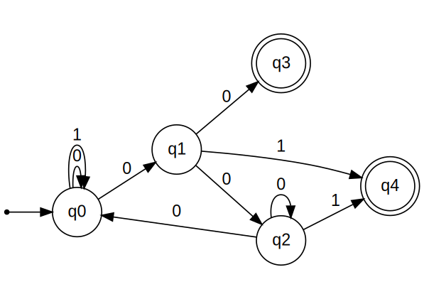
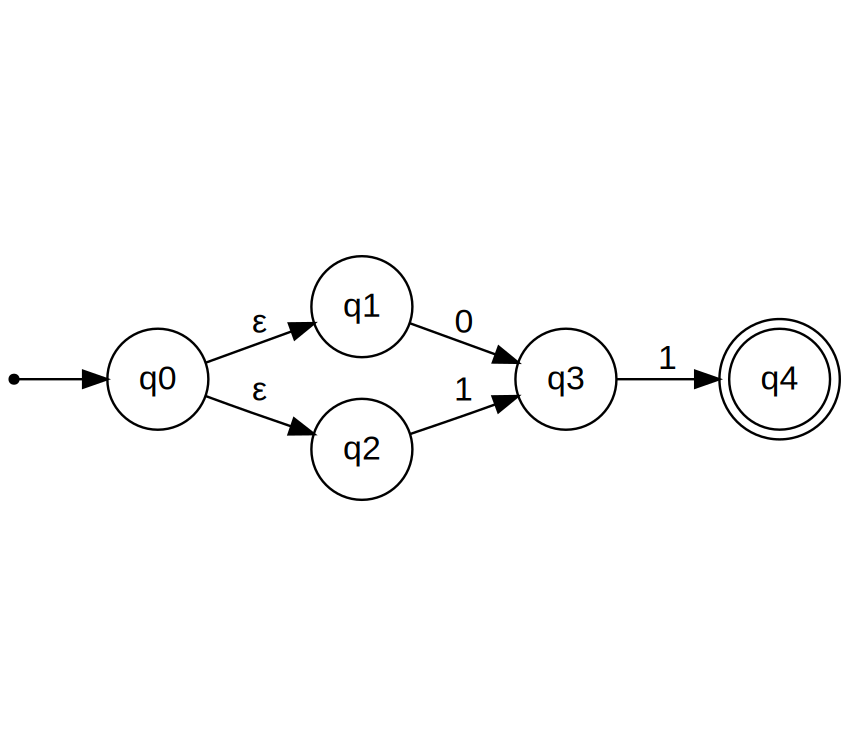
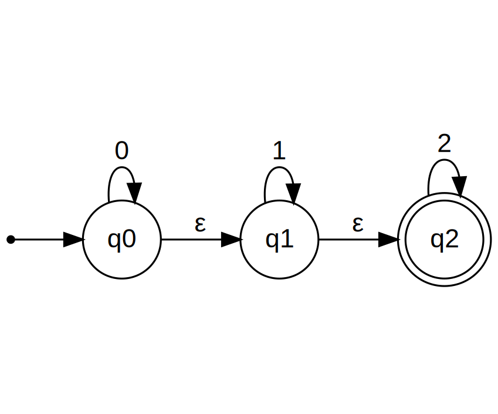
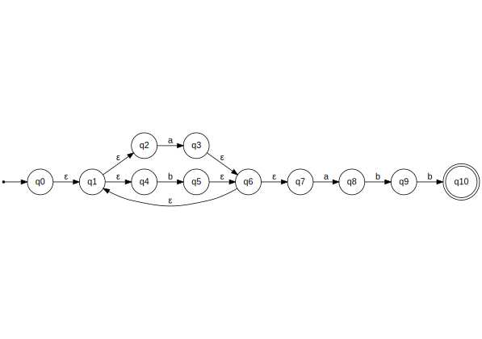

## Exemplos DFA:
#### 01
<!--
http://magjac.com/graphviz-visual-editor/?dot=digraph%20finite_state_machine%20%7B%0A%09fontname%3D%22Helvetica%2CArial%2Csans-serif%22%0A%09node%20%5Bfontname%3D%22Helvetica%2CArial%2Csans-serif%22%5D%0A%09edge%20%5Bfontname%3D%22Helvetica%2CArial%2Csans-serif%22%5D%0A%09rankdir%3DLR%3B%0A%09init%20%5Bshape%3Dpoint%5D%3B%20%0A%09s0%5Bshape%20%3D%20doublecircle%5D%3B%0A%0A%09node%20%5Bshape%20%3D%20circle%5D%3B%0A%09%0A%0A%09init%20-%3E%20s0%3B%0A%09s0%20-%3E%20s0%20%5Blabel%20%3D%20%220%22%5D%3B%0A%09s0%20-%3E%20s1%20%5Blabel%20%3D%20%221%22%5D%3B%0A%09s1%20-%3E%20s0%20%5Blabel%20%3D%20%221%22%5D%3B%0A%09s1%20-%3E%20s2%20%5Blabel%20%3D%20%220%22%5D%3B%0A%09s2%20-%3E%20s1%20%5Blabel%20%3D%20%220%22%5D%3B%0A%0A%7D
-->


Exemplo de entrada:
```
Exemplo DFA 01:
{
    "regras_de_transicao":[
    s0, s0, 0
    s0, s1, 1
    s1, s0, 1
    s1, s2, 0
    s2, s1, 0
    ]
    "estado_inicial": s0
    "estado_final":[
    s0
    ]
    "palavras":[
    
    ]
}
```

#### 02
<!--
http://magjac.com/graphviz-visual-editor/?dot=digraph%20finite_state_machine%20%7B%0A%09fontname%3D%22Helvetica%2CArial%2Csans-serif%22%0A%09node%20%5Bfontname%3D%22Helvetica%2CArial%2Csans-serif%22%5D%0A%09edge%20%5Bfontname%3D%22Helvetica%2CArial%2Csans-serif%22%5D%0A%09rankdir%3DLR%3B%0A%09init%20%5Bshape%3Dpoint%5D%3B%20%0A%09q1%5Bshape%20%3D%20doublecircle%5D%3B%0A%0A%09node%20%5Bshape%20%3D%20circle%5D%3B%0A%09%0A%0A%09init%20-%3E%20q0%3B%0A%09q0%20-%3E%20q2%20%5Blabel%20%3D%20%220%22%5D%3B%0A%09q0%20-%3E%20q1%20%5Blabel%20%3D%20%221%22%5D%3B%0A%09q1%20-%3E%20q3%20%5Blabel%20%3D%20%220%22%5D%3B%0A%09q1%20-%3E%20q0%20%5Blabel%20%3D%20%221%22%5D%3B%0A%09q2%20-%3E%20q0%20%5Blabel%20%3D%20%220%22%5D%3B%0A%09q2%20-%3E%20q3%20%5Blabel%20%3D%20%221%22%5D%3B%0A%09q3%20-%3E%20q1%20%5Blabel%20%3D%20%220%22%5D%3B%0A%09q3%20-%3E%20q2%20%5Blabel%20%3D%20%221%22%5D%3B%0A%0A%0A%7D
-->


Exemplo de entrada:
```
Exemplo DFA 02:
{
    "regras_de_transicao":[
    q0, q2, 0
    q0, q1, 1
    q1, q3, 0
    q1, q0, 1
    q2, q0, 0
    q2, q3, 1
    q3, q1, 0
    q3, q2, 1
    ]
    "estado_inicial": q0
    "estado_final":[
    q1
    ]
    "palavras":[
    
    ]
}
```

#### 03
<!--
http://magjac.com/graphviz-visual-editor/?dot=digraph%20finite_state_machine%20%7B%0A%09fontname%3D%22Helvetica%2CArial%2Csans-serif%22%0A%09node%20%5Bfontname%3D%22Helvetica%2CArial%2Csans-serif%22%5D%0A%09edge%20%5Bfontname%3D%22Helvetica%2CArial%2Csans-serif%22%5D%0A%09rankdir%3DLR%3B%0A%09init%20%5Bshape%3Dpoint%5D%3B%20%0A%09node%5Bshape%20%3D%20doublecircle%5D%3B%0A%20%20%20%20q0%3B%0A%09node%20%5Bshape%20%3D%20circle%5D%3B%0A%09%0A%0A%09init%20-%3E%20q0%3B%0A%09q0%20-%3E%20q2%20%5Blabel%20%3D%20%220%22%5D%3B%0A%09q0%20-%3E%20q1%20%5Blabel%20%3D%20%221%22%5D%3B%0A%09q1%20-%3E%20q3%20%5Blabel%20%3D%20%220%22%5D%3B%0A%09q1%20-%3E%20q0%20%5Blabel%20%3D%20%221%22%5D%3B%0A%09q2%20-%3E%20q3%20%5Blabel%20%3D%20%220%22%5D%3B%0A%09q2%20-%3E%20q3%20%5Blabel%20%3D%20%221%22%5D%3B%0A%09q3%20-%3E%20q1%20%5Blabel%20%3D%20%220%22%5D%3B%0A%09q3%20-%3E%20q2%20%5Blabel%20%3D%20%221%22%5D%3B%0A%0A%7D
-->


Exemplo de entrada:
```
Exemplo DFA 03:
{
    "regras_de_transicao":[
    q0, q2, 0
    q0, q1, 1
    q1, q3, 0
    q1, q0, 1
    q2, q3, 0
    q2, q3, 1
    q3, q1, 0
    q3, q2, 1
    ]
    "estado_inicial": q0
    "estado_final":[
    q0
    ]
    "palavras":[
    
    ]
}
```

## Exemplos NFA:
#### 01
<!--
http://magjac.com/graphviz-visual-editor/?dot=digraph%20finite_state_machine%20%7B%0A%09fontname%3D%22Helvetica%2CArial%2Csans-serif%22%0A%09node%20%5Bfontname%3D%22Helvetica%2CArial%2Csans-serif%22%5D%0A%09edge%20%5Bfontname%3D%22Helvetica%2CArial%2Csans-serif%22%5D%0A%09rankdir%3DLR%3B%0A%09init%20%5Bshape%3Dpoint%5D%3B%20%0A%09q2%5Bshape%20%3D%20doublecircle%5D%3B%0A%0A%09node%20%5Bshape%20%3D%20circle%5D%3B%0A%09%0A%0A%09init%20-%3E%20q0%3B%0A%09q0%20-%3E%20q0%20%5Blabel%20%3D%20%220%22%5D%3B%0A%09q0%20-%3E%20q1%20%5Blabel%20%3D%20%221%22%5D%3B%0A%09q1%20-%3E%20q1%20%5Blabel%20%3D%20%220%22%5D%3B%0A%09q1%20-%3E%20q1%20%5Blabel%20%3D%20%221%22%5D%3B%0A%09q1%20-%3E%20q2%20%5Blabel%20%3D%20%220%22%5D%3B%0A%09q2%20-%3E%20q2%20%5Blabel%20%3D%20%220%22%5D%3B%0A%09q2%20-%3E%20q2%20%5Blabel%20%3D%20%221%22%5D%3B%0A%09q2%20-%3E%20q1%20%5Blabel%20%3D%20%221%22%5D%3B%0A%0A%0A%0A%7D
-->


Exemplo de entrada:
```
Exemplo NFA 01:
{
    "regras_de_transicao":[
    q0, q0, 0
    q0, q1, 1
    q1, q1, 0
    q1, q1, 1
    q1, q2, 0
    q2, q2, 0
    q2, q2, 1
    q2, q1, 1
    ]
    "estado_inicial": q0
    "estado_final":[
    q2
    ]
    "palavras":[
    
    ]
}
```

#### 02
<!--
http://magjac.com/graphviz-visual-editor/?dot=digraph%20finite_state_machine%20%7B%0A%09fontname%3D%22Helvetica%2CArial%2Csans-serif%22%0A%09node%20%5Bfontname%3D%22Helvetica%2CArial%2Csans-serif%22%5D%0A%09edge%20%5Bfontname%3D%22Helvetica%2CArial%2Csans-serif%22%5D%0A%09rankdir%3DLR%3B%0A%09init%20%5Bshape%3Dpoint%5D%3B%20%0A%09q1%5Bshape%20%3D%20doublecircle%5D%3B%0A%0A%09node%20%5Bshape%20%3D%20circle%5D%3B%0A%09%0A%0A%09init%20-%3E%20q0%3B%0A%09q0%20-%3E%20q0%20%5Blabel%20%3D%20%220%22%5D%3B%0A%09q0%20-%3E%20q1%20%5Blabel%20%3D%20%220%22%5D%3B%0A%09q0%20-%3E%20q1%20%5Blabel%20%3D%20%221%22%5D%3B%0A%09q1%20-%3E%20q1%20%5Blabel%20%3D%20%221%22%5D%3B%0A%09q1%20-%3E%20q0%20%5Blabel%20%3D%20%221%22%5D%3B%0A%0A%0A%0A%0A%7D
-->


Exemplo de entrada:
```
Exemplo NFA 02:
{
    "regras_de_transicao":[
    q0, q0, 0
    q0, q1, 0
    q0, q1, 1
    q1, q1, 1
    q1, q0, 1
    ]
    "estado_inicial": q0
    "estado_final":[
    q1
    ]
    "palavras":[

    ]
}
```

<!--
http://magjac.com/graphviz-visual-editor/?dot=digraph%20finite_state_machine%20%7B%0A%09fontname%3D%22Helvetica%2CArial%2Csans-serif%22%0A%09node%20%5Bfontname%3D%22Helvetica%2CArial%2Csans-serif%22%5D%0A%09edge%20%5Bfontname%3D%22Helvetica%2CArial%2Csans-serif%22%5D%0A%09rankdir%3DLR%3B%0A%09init%20%5Bshape%3Dpoint%5D%3B%20%0A%09node%5Bshape%20%3D%20doublecircle%5D%3B%0A%20%20%20%20q1%3B%20q0q1%0A%09node%20%5Bshape%20%3D%20circle%5D%3B%0A%09%0A%0A%09init%20-%3E%20q0%3B%0A%09q0%20-%3E%20q0q1%20%5Blabel%20%3D%20%220%22%5D%3B%0A%09q0%20-%3E%20q1%20%5Blabel%20%3D%20%221%22%5D%3B%0A%09q1%20-%3E%20q0q1%20%5Blabel%20%3D%20%221%22%5D%3B%0A%09q0q1%20-%3E%20q0q1%20%5Blabel%20%3D%20%220%22%5D%3B%0A%09q0q1%20-%3E%20q0q1%20%5Blabel%20%3D%20%221%22%5D%3B%0A%0A%0A%0A%0A%7D
-->


#### 03
<!--
http://magjac.com/graphviz-visual-editor/?dot=digraph%20finite_state_machine%20%7B%0A%09fontname%3D%22Helvetica%2CArial%2Csans-serif%22%0A%09node%20%5Bfontname%3D%22Helvetica%2CArial%2Csans-serif%22%5D%0A%09edge%20%5Bfontname%3D%22Helvetica%2CArial%2Csans-serif%22%5D%0A%09rankdir%3DLR%3B%0A%09init%20%5Bshape%3Dpoint%5D%3B%20%0A%09node%5Bshape%20%3D%20doublecircle%5D%3B%0A%20%20%20%20q3%3Bq4%3B%0A%09node%20%5Bshape%20%3D%20circle%5D%3B%0A%09%0A%0A%09init%20-%3E%20q0%3B%0A%09q0%20-%3E%20q0%20%5Blabel%20%3D%20%220%22%5D%3B%0A%09q0%20-%3E%20q1%20%5Blabel%20%3D%20%220%22%5D%3B%0A%09q0%20-%3E%20q0%20%5Blabel%20%3D%20%221%22%5D%3B%0A%09q1%20-%3E%20q2%20%5Blabel%20%3D%20%220%22%5D%3B%0A%09q1%20-%3E%20q3%20%5Blabel%20%3D%20%220%22%5D%3B%0A%09q1%20-%3E%20q4%20%5Blabel%20%3D%20%221%22%5D%3B%0A%09q2%20-%3E%20q0%20%5Blabel%20%3D%20%220%22%5D%3B%0A%09q2%20-%3E%20q2%20%5Blabel%20%3D%20%220%22%5D%3B%0A%09q2%20-%3E%20q4%20%5Blabel%20%3D%20%221%22%5D%3B%0A%0A%7D
-->


Exemplo de entrada:
```
Exemplo NFA 03:
{
    "regras_de_transicao":[
    q0, q0, 0
    q0, q1, 0
    q0, q0, 1
    q1, q2, 0
    q1, q3, 0
    q1, q4, 1
    q2, q0, 0
    q2, q2, 0
    q2, q4, 1
    ]
    "estado_inicial": q0
    "estado_final":[
    q3
    q4
    ]
    "palavras":[
    
    ]
}
```

## Exemplos ε-NFA:

#### 01
<!--
http://magjac.com/graphviz-visual-editor/?dot=digraph%20finite_state_machine%20%7B%0A%09fontname%3D%22Helvetica%2CArial%2Csans-serif%22%0A%09node%20%5Bfontname%3D%22Helvetica%2CArial%2Csans-serif%22%5D%0A%09edge%20%5Bfontname%3D%22Helvetica%2CArial%2Csans-serif%22%5D%0A%09rankdir%3DLR%3B%0A%09init%20%5Bshape%3Dpoint%5D%3B%20%0A%09node%5Bshape%20%3D%20doublecircle%5D%3B%0A%20%20%20%20q4%3B%0A%09node%20%5Bshape%20%3D%20circle%5D%3B%0A%09%0A%0A%09init%20-%3E%20q0%3B%0A%09q0%20-%3E%20q1%20%5Blabel%20%3D%20%22%CE%B5%22%5D%3B%0A%09q0%20-%3E%20q2%20%5Blabel%20%3D%20%22%CE%B5%22%5D%3B%0A%09q1%20-%3E%20q3%20%5Blabel%20%3D%20%220%22%5D%3B%0A%09q2%20-%3E%20q3%20%5Blabel%20%3D%20%221%22%5D%3B%0A%09q3%20-%3E%20q4%20%5Blabel%20%3D%20%221%22%5D%3B%0A%0A%7D
-->


Exemplo de entrada:
```
Exemplo E-NFA 01:
{
    "regras_de_transicao":[
    q0, q1, E
    q0, q2, E
    q1, q3, 0
    q2, q3, 1
    q3, q4, 1
    ]
    "estado_inicial": q0
    "estado_final":[
    q4
    ]
    "palavras":[

    ]
}
```

#### 02
<!--
http://magjac.com/graphviz-visual-editor/?dot=digraph%20finite_state_machine%20%7B%0A%09fontname%3D%22Helvetica%2CArial%2Csans-serif%22%0A%09node%20%5Bfontname%3D%22Helvetica%2CArial%2Csans-serif%22%5D%0A%09edge%20%5Bfontname%3D%22Helvetica%2CArial%2Csans-serif%22%5D%0A%09rankdir%3DLR%3B%0A%09init%20%5Bshape%3Dpoint%5D%3B%20%0A%09node%5Bshape%20%3D%20doublecircle%5D%3B%0A%20%20%20%20q2%3B%0A%09node%20%5Bshape%20%3D%20circle%5D%3B%0A%09%0A%0A%09init%20-%3E%20q0%3B%0A%09q0%20-%3E%20q0%20%5Blabel%20%3D%20%220%22%5D%3B%0A%09q0%20-%3E%20q1%20%5Blabel%20%3D%20%22%CE%B5%22%5D%3B%0A%09q1%20-%3E%20q1%20%5Blabel%20%3D%20%221%22%5D%3B%0A%09q1%20-%3E%20q2%20%5Blabel%20%3D%20%22%CE%B5%22%5D%3B%0A%09q2%20-%3E%20q2%20%5Blabel%20%3D%20%222%22%5D%3B%0A%0A%7D
-->


Exemplo de entrada:
```
Exemplo E-NFA 02:
{
    "regras_de_transicao":[
    q0, q0, 0
    q0, q1, E
    q1, q1, 1
    q1, q2, E
    q2, q2, 2
    ]
    "estado_inicial": q0
    "estado_final":[
    q10
    ]
    "palavras":[

    ]
}
```

#### 03
<!--
http://magjac.com/graphviz-visual-editor/?dot=digraph%20finite_state_machine%20%7B%0A%09fontname%3D%22Helvetica%2CArial%2Csans-serif%22%0A%09node%20%5Bfontname%3D%22Helvetica%2CArial%2Csans-serif%22%5D%0A%09edge%20%5Bfontname%3D%22Helvetica%2CArial%2Csans-serif%22%5D%0A%09rankdir%3DLR%3B%0A%09init%20%5Bshape%3Dpoint%5D%3B%20%0A%09node%5Bshape%20%3D%20doublecircle%5D%3B%0A%20%20%20%20q10%3B%0A%09node%20%5Bshape%20%3D%20circle%5D%3B%0A%09%0A%0A%09init%20-%3E%20q0%3B%0A%09q0%20-%3E%20q1%20%5Blabel%20%3D%20%22%CE%B5%22%5D%3B%0A%09q1%20-%3E%20q2%20%5Blabel%20%3D%20%22%CE%B5%22%5D%3B%0A%09q1%20-%3E%20q4%20%5Blabel%20%3D%20%22%CE%B5%22%5D%3B%0A%09q2%20-%3E%20q3%20%5Blabel%20%3D%20%22a%22%5D%3B%0A%09q3%20-%3E%20q6%20%5Blabel%20%3D%20%22%CE%B5%22%5D%3B%0A%09q4%20-%3E%20q5%20%5Blabel%20%3D%20%22b%22%5D%3B%0A%09q5%20-%3E%20q6%20%5Blabel%20%3D%20%22%CE%B5%22%5D%3B%0A%09q6%20-%3E%20q1%20%5Blabel%20%3D%20%22%CE%B5%22%5D%3B%0A%09q6%20-%3E%20q7%20%5Blabel%20%3D%20%22%CE%B5%22%5D%3B%0A%09q7%20-%3E%20q8%20%5Blabel%20%3D%20%22a%22%5D%3B%0A%09q8%20-%3E%20q9%20%5Blabel%20%3D%20%22b%22%5D%3B%0A%09q9%20-%3E%20q10%20%5Blabel%20%3D%20%22b%22%5D%3B%0A%0A%0A%7D
-->


Exemplo de entrada:
```
Exemplo E-NFA 03:
{
    "regras_de_transicao":[
    q0, q1, E
    q1, q2, E
    q1, q4, E
    q2, q3, a
    q3, q6, E
    q4, q5, b
    q5, q6, E
    q6, q1, E
    q6, q7, E
    q7, q8, a
    q8, q9, b
    q9, q10, b
    ]
    "estado_inicial": q0
    "estado_final":[
    q10
    ]
    "palavras":[

    ]
}
```

